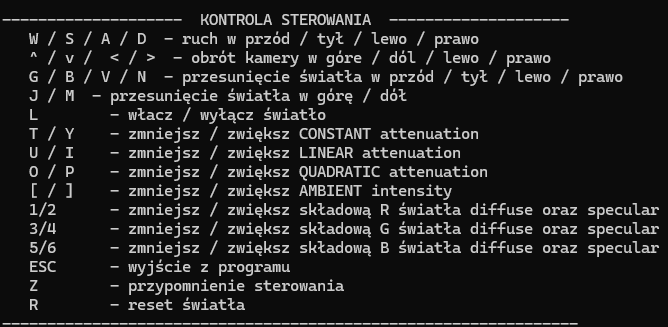

# Komin 3D - Sebastian Zarębski

**Komin 3D** to projekt symulacji pokoju w 3D w którym sterujemy kamera oraz oświetleniem, zmieniając jego parametry. Zawiera on oteksturowane obiekty, kolizje, oświetlenie oraz mgłę. Projekt został stworzony w C++ przy użyciu **SFML** oraz **OpenGL**.

---

## Funkcjonalności

- Renderowanie prostego pokoju z teksturami:
  - Ściany, podłoga, sufit
  - Kominek
  - Trawa na zewnątrz pokoju
- Obsługa wielu tekstur za pomocą biblioteki **STB_Image**
- Sterowanie kamerą w stylu FPS:
  - `W`, `A`, `S`, `D` – poruszanie się po pokoju
  - Strzałki – obracanie kamery w pionie i poziomie
- Ograniczenie ruchu kamery do wnętrza pokoju
- Oświetlenie sceny oraz sterowanie parametrami światła (Opisane dokładnie przy uruchomieniu programu w konsoli)
---

## Technologie i biblioteki

- C++
- **SFML** – obsługa okna, zdarzeń i kontekstu OpenGL
- **OpenGL** – renderowanie 3D, oświetlenie i tekstury
- **STB_Image** – ładowanie obrazów jako tekstury
- Tekstury zostały wygenerowane za pomoca AI, oprócz trawy : https://www.craiyon.com/en/image/IP0qtWGERRaf54eHGSPzfg

---

## Uruchomienie

1. Ściągnięcie oraz rozpakowanie pliku .rar
2. Uruchomienie main.sln
3. Zbudowanie projektu w Visual Studio oraz uruchomienie

## Screenshoty

|  |
|:-------------------------:|

|  |
|:-------------------------:|

